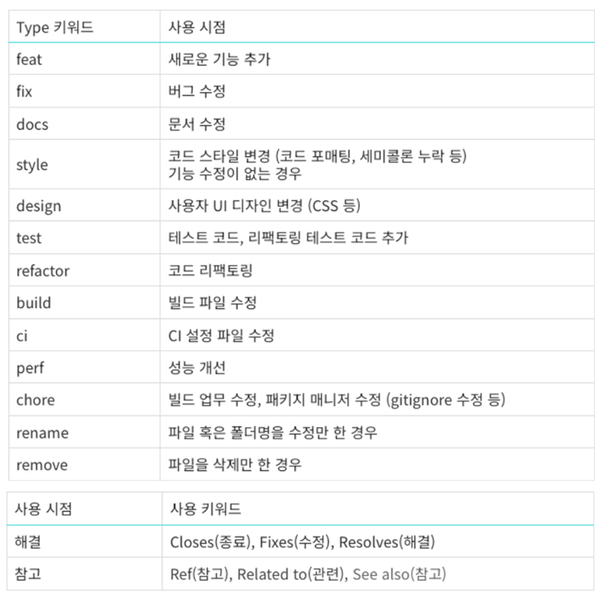

<br>

#### 👉 **새로운 프로젝트, 사업 아이디어 구상을 도와줄 온라인 실시간 협업 툴**

<br>

**아이디어 기획에 어려움을 겪는 사람들을 위한 도구**로서, <br>
팀원들과의 온라인 실시간 협업을 통해 아이디어 보드를 자유롭게 꾸밀 수 있습니다.

1. **다양한 아이디어 기법을 적용한 탬플릿을 제공합니다.**
-
-
-

2. **튜토리얼을 통해 아이디어 기법에 쉽게 접근할 수 있습니다.**
- 아이디어 기법에 대한 이해가 전혀 없는 사람도 쉽게 사용할 수 있습니다.

3. **실시간 협업 및 소통을 지원합니다.**
- 화이트보드 협업
- 실시간 문자 채팅
- 화상 회의 및 음성 채팅
- 화면 공유

4. **다양한 도구를 사용해 마음껏 보드를 꾸밀 수 있습니다.**
- 다양한 도형과 도형 편집 옵션 제공
- 텍스트 및 선으로 마음껏 생각을 표현하세요.

5. **여러분의 작업물은 언제나 안전하게 보관됩니다.**
- 작업과 동시에 저장되는 진행사항
- 언제든 다시 돌아와 이전의 아이디어를 살펴보세요!

<br>

> [_지금 사용해보세요._](https://i10b104.p.ssafy.io)

***

## 📌 사용 예시

- ?

***

## 📌 Team Convention

### 🔷 Git Convention


Type 키워드 맨 앞글자는 대문자 사용  ( ex. Feat: ~ )



### 🔷 Frontend Convention

- Feat : 새로운 기능 추가 (대부분에 사용)
- Fix : 버그 발생 시
- Design : UI 변경 시 (CSS)

❗ 변경 시 마다 커밋! 고칠 때 이왕이면 기능별 수정사항 한번에 ❗

```
(예시)

- Feat: 홈 버튼 생성
- Fix: 홈 버튼 클릭이 안되는 버그 수정
- Design: 홈 버튼 좌우간격 수정
```

### 🔷 Backend Convention

- Git: 대표 컨벤션 그대로 사용 (위의 이미지)
- Springboot-app: 클래스명은 파스칼 케이스, 그 외 카멜 케이스 사용
- Database: RDB의 column 및 NoSQL 컬렉션의 key 값 모두 카멜 케이스 사용

### 🔷 API URL 명명규칙

1. URL을 작성할 때는 소문자를 사용한다.
2. 언더바(’_’) 대신 하이픈(’-’)을 사용한다.
3. 마지막에 슬래시(’/’)를 포함하지 않는다.
4. 파일 확장자는 URL에 포함시키지 않는다.

***

## 📌 Tech Stack

- ?

***

## 📌 ERD

- ?

***

## 📌 API Specification

- ?

***

## 📌 Jenkins Build

- ?

***

## 📌 Jira & Gerrit

- ?

***

## 📌 Team '선' 보고 '후' 조치

- ?

