 

#### 👉 **새로운 프로젝트, 사업 아이디어 구상을 도와줄 온라인 실시간 협업 툴**

 

**아이디어 기획에 어려움을 겪는 사람들을 위한 도구**로서,  
팀원들과의 온라인 실시간 협업을 통해 아이디어 보드를 자유롭게 꾸밀 수 있습니다.

1. **다양한 아이디어 기법을 적용한 템플릿을 제공합니다.**
- 아이디어 시각화 뿐만 아니라 도출을 적극적으로 돕는 템플릿 제공
- 교육학 논문 내용 기반의 변형 또는 자체 제작을 통한 차별화 
(1) 화이트 보드 (White Board) : 여러분의 아이디어, 자유롭게 표현해보세요! 
(2) 랜덤 버블 (Random Bubble) : 빈 화면에서 막연한 고민은 그만! 랜덤 단어의 도움을 받아보세요. 
(3) 6가지 생각 모자 (6hats) : 역할모자를 쓰고 관점을 다르게 하여 분석 해보는 것은 어떨까요? 
(4) 세븐쳌 (7check) : 기존에서 하나씩 체크해가면서 조금 바꿔보는 것은 어떨까요?

2. **튜토리얼을 통해 아이디어 기법에 쉽게 접근할 수 있습니다.**
- 입문자 및 초보자를 위한 상세한 템플릿 튜토리얼
- 튜토리얼을 통한 아이디어 기법에의 쉬운 접근 가능
- 아이디어 기법에 대한 이해가 부족한 사람도 손쉽게 사용 가능

3. **실시간 협업 및 소통을 위한 보드, 문자채팅, 화상회의를 지원합니다.**
- 화이트보드 협업
- 실시간 문자 채팅
- 화상 회의

4. **다양한 도구를 사용해 마음껏 보드를 꾸밀 수 있습니다.**
- 다양한 도형과 도형 편집 옵션 제공
- 텍스트, 선, 이미지 등으로 마음껏 생각을 표현하세요.

5. **여러분의 작업물은 자동 저장되며, 언제나 안전하게 보관됩니다.**
- 작업과 동시에 저장되는 진행사항
- 언제든 다시 돌아와 이전의 아이디어를 살펴보세요!

 

> [_지금 사용해보세요._](https://i10b104.p.ssafy.io)

***

## 📌 사용 예시

### 🔷 소셜 로그인 (naver)

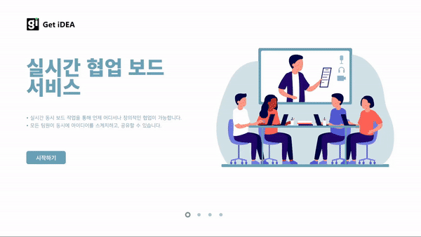

### 🔷프로젝트 생성 (white board)

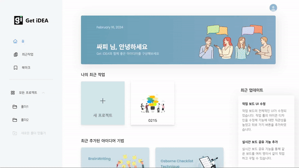

### 🔷 탬플릿 튜토리얼 (7Check template)

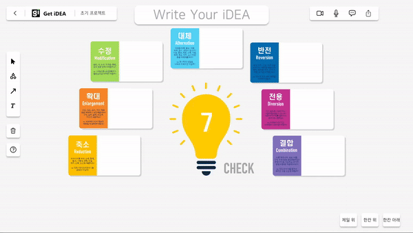

### 🔷 실시간 협업 및 화상 회의

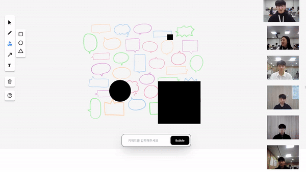

### 🔷 프로젝트 관리 (폴더, 이름 수정, 북마크 기능)

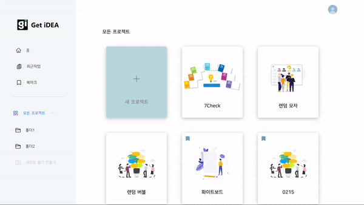

### 🔷 유저 관리 (프로필, 이름 변경 기능)

***

## 📌 Team Convention

### 🔷 Git Convention

Type 키워드 맨 앞글자는 대문자 사용  ( ex. Feat: ~ )

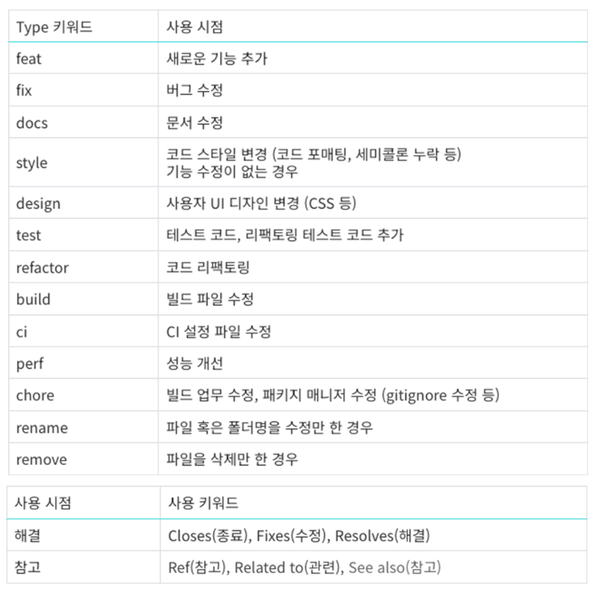

❗ 변경 시 마다 커밋! 고칠 때는 기능별 수정사항 한번에 ❗
### 🔷 Frontend Convention

- Feat : 새로운 기능 추가 (대부분에 사용) ex. 홈 버튼 생성
- Fix : 버그 발생 시 ex. 홈 버튼 클릭이 안되는 버그 수정
- Design : UI 변경 시 (CSS) ex. 홈 버튼 좌우간격 수정

### 🔷 Backend Convention

- Git: 대표 컨벤션 그대로 사용 (위의 이미지)
- Springboot-app: 클래스명은 파스칼 케이스, 그 외 카멜 케이스 사용
- Database: RDB의 column 및 NoSQL 컬렉션의 key 값 모두 카멜 케이스 사용

### 🔷 API URL 명명규칙

1. URL을 작성할 때는 소문자를 사용한다.
2. 언더바(’_’) 대신 하이픈(’-’)을 사용한다.
3. 마지막에 슬래시(’/’)를 포함하지 않는다.
4. 파일 확장자는 URL에 포함시키지 않는다.

***

## 📌 Jira & Gerrit

### 🔷 Jira

🔥 _번다운 차트_

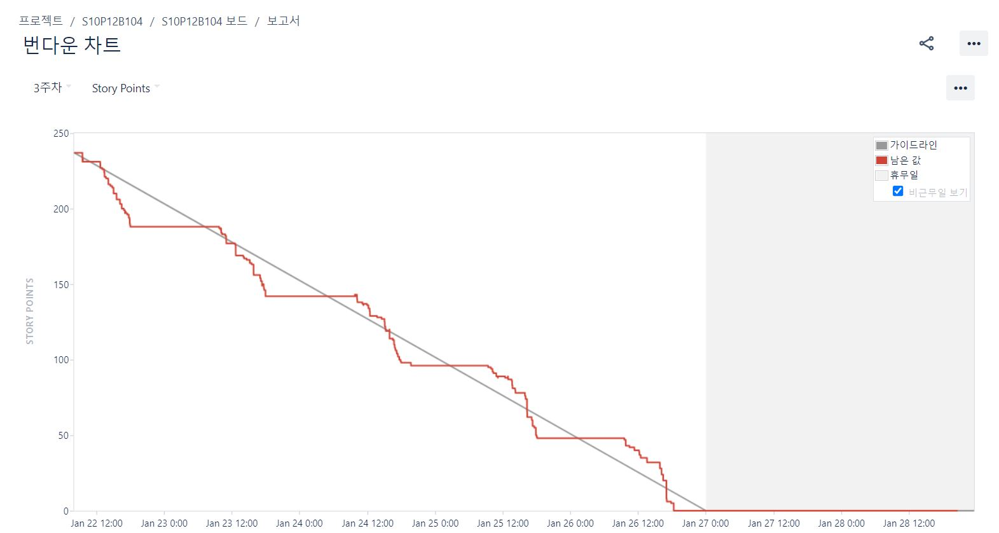

- 매일 인당 스토리 포인트 8점씩 부여하여 스케줄 관리
- 극초반 Jira 사용 요령이 생기기 전 이외엔 모두 이상적인 그래프를 기록

⏰ _타임라인_

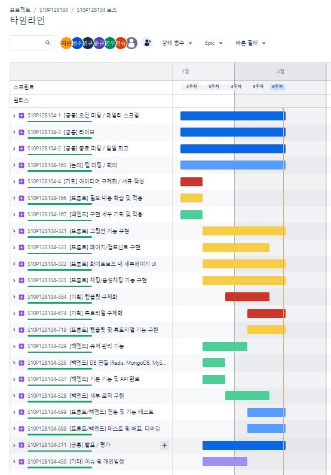

- 스프린트 일정은 대분류를 회의와 같은 공통, 기획, 프론트, 백엔드, 기타로 구분
- 프론트엔드와 백엔드는 큰 기능 구현 및 대형 작업을 위주로 업무를 구분

### 🔷 Gerrit

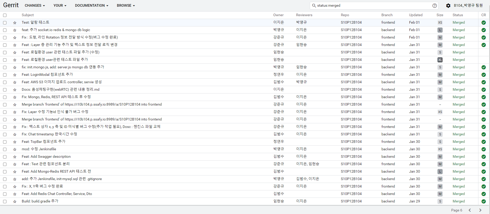

- Gitlab에 직접적인 push를 넣는 방식 대신 코드리뷰를 거쳐야만 push가 가능한 `gerrit`을 활용
- 코드리뷰는 리뷰어를 따로 지정해두지 않고 그 때 그 때 가능한 사람을 지정하여 코드리뷰를 부탁하는 형식으로 진행됨

***

## 📌 Tech Stack

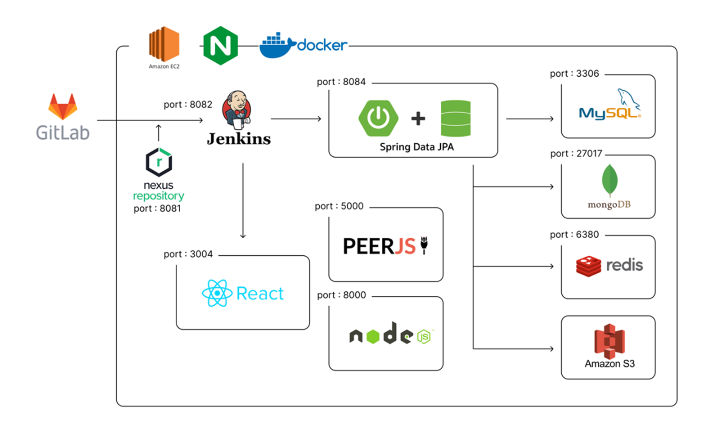

### 🔷 BackEnd

 -6DB33F?style=flat-square&logo=Springboot&logoColor=white) -02303A?style=flat-square&logo=gradle&logoColor=white) -000000?style=flat-square&logoColor=white)
 -6DB33F?style=flat-square&logo=Springsecurity&logoColor=white) -047AED?style=flat-square&logo=keycdn&logoColor=white) -339933?style=flat-square&logo=node.js&logoColor=white)
-000000?style=flat-square&logoColor=white) -85EA2D?style=flat-square&logo=swagger&logoColor=white)

### 🔷 FrontEnd

-61DAFB?style=flat-square&logo=react&logoColor=white) -2C8EBB?style=flat-square&logo=yarn&logoColor=white) -06B6D4?style=flat-square&logo=tailwindcss&logoColor=white) -3178C6?style=flat-square&logo=typescript&logoColor=white)
-F7DF1E?style=flat-square&logo=javascript&logoColor=white) -339933?style=flat-square&logo=node.js&logoColor=white) 
-00AA45?style=flat-square&logo=peerlist&logoColor=white)

### 🔷 DataBase
-4479A1?style=flat-square&logo=mysql&logoColor=white) -DC382D?style=flat-square&logo=redis&logoColor=white) -47A248?style=flat-square&logo=mongodb&logoColor=white) -569A31?style=flat-square&logo=amazons3&logoColor=white)

### 🔷 DevOps
   
 

***

## 📌 ERD(DB 시각화)

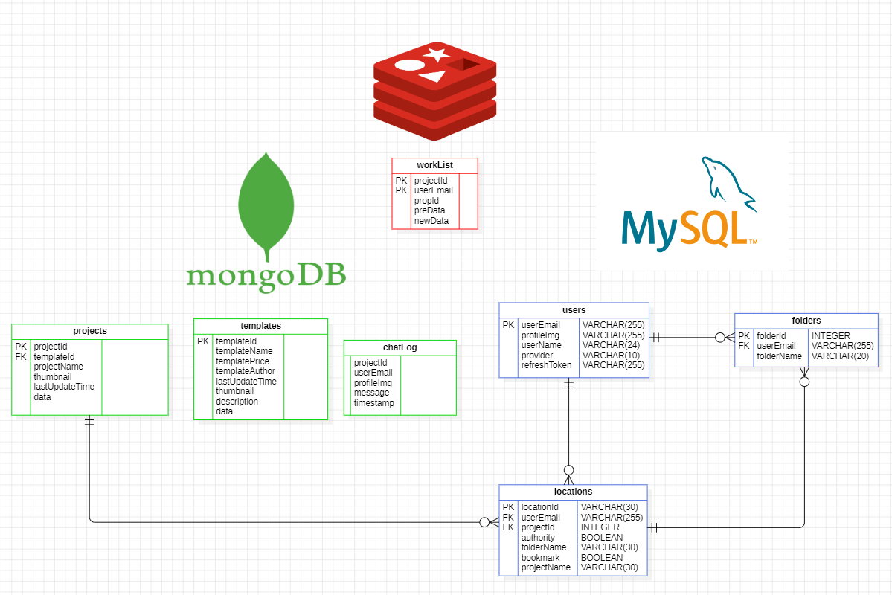

> `mongoDB`와 `redis`는 NoSQL DB이기 때문에 컬렉션 구조와 다른 데이터베이스의 테이블과 맺는 관계를 ERD로 그리는 것은 어불성설이나, 개발자의 개발 편의를 위해 시각화해두었음을 밝힌다.

***

## 📌 Team '선' 보고 '후' 조치

> [🔗 Team Notion](https://galvanized-citron-903.notion.site/Get-iDEA-29c9eb0938454ad2a4dfe0035eb37c72?pvs=4)

👤 **팀장 이지은**
 - `ProjectManager`(기획 및 GIT, Gerrit, Jira 등 활용 프로젝트 관리), `FrontEnd`(Template 및 튜토리얼 기획, 디자인 및 기능 구현)

👤 **팀원 정연우**
 - `Designer`(UI), `FrontEnd`(Main, Login, board 등 페이지/컴포넌트 디자인 및 기능 구현)

👤 **팀원 강준규**
 - `WebRTC`(peer.js 화상회의, node server 구현), `Websocket`(문자채팅, 실시간 협업기능, node server 구현), `FrontEnd`(board 페이지 기능 구현)

👤 **팀원 임현승**
 - `BackEnd`(mysql 관련 RESTful Api 제작 등), `FrontEnd 보조`(Template 및 튜토리얼 기능 구현)

👤 **팀원 박영규**
 - `BackEnd`(Database 설계, DB 서버 구축, WebSocket Server), `DevOps`(인프라 구축, 깃랩-젠킨스-EC2 파이프라인 구축)

👤 **팀원 김범수**
 - `BackEnd`(Database 설계, Redis, MongoDB 관련 RESTful Api 제작, OAuth JWT 작업), `DevOps`(테스트 서버 지원)

